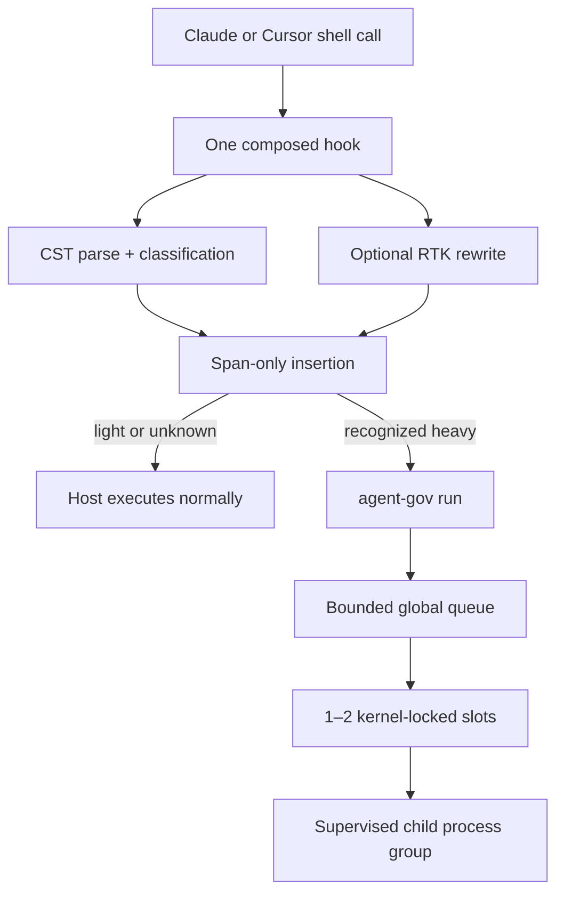

# Agent Governor

**Keep your Mac responsive while multiple coding agents build, test, and install dependencies.**

`agent-gov` is a small native workload governor for local AI coding agents. It composes with
Claude Code, Cursor, and [RTK](https://github.com/rtk-ai/rtk), limiting recognized heavy commands
*before* their process trees are created.

> Status: **public preview (`v0.1.0`)**. The core scheduler, conservative shell rewrite, RTK adapter,
> Claude/Cursor adapters, transactional installation, and diagnostics are implemented. Run
> `agent-gov doctor` after every install. See [compatibility](docs/compatibility.md) before enabling
> it on a managed workstation.

## Why this exists

Running four to six agents at once can produce several concurrent Gradle, Maven, Node, Cargo, or
Xcode workloads. Each workload fans out into processes, threads, file operations, heaps, and
buffers. Endpoint security, DLP, proxy, and observability software may inspect those events while
competing for the same CPU, memory, and I/O.

Agent Governor does **not** claim that serialized builds create fewer total events. It limits the
instantaneous work in progress (WIP), reducing peaks and non-linear contention such as swap,
thrashing, retries, timeouts, and cache churn. Responsiveness is the primary objective; throughput
must be measured on the target Mac.

## How it works



- One global per-user pool, capacity `1` or `2`; default `1`.
- No daemon, database, root privileges, network runtime, or telemetry.
- Kernel advisory locks are released automatically when a supervisor exits.
- At most eight waiting workloads by default; queue overflow and timeout return `EX_TEMPFAIL` (75).
- Heavy commands never run outside the governor after they have been recognized.
- Unknown or unsupported shell syntax passes through unchanged.
- RTK failure never bypasses classification or governance.

## Install

The prebuilt release supports Apple Silicon and Intel Macs. It installs without `sudo` in
`~/.local/bin`, configures one composed hook for Claude Code and Cursor, and runs diagnostics:

```bash
curl --proto '=https' --tlsv1.2 -sSfL \
  https://raw.githubusercontent.com/gabriel17carmo/agent-gov/main/install-agent-gov.sh | bash
```

The script downloads the latest universal binary and its SHA-256 checksum from GitHub Releases. It
does not install RTK or edit your shell profile. You can
[inspect the installer](install-agent-gov.sh) before running it. If `~/.local/bin` is not already on
`PATH`, add this to `~/.zshrc` and open a new terminal:

```bash
export PATH="$HOME/.local/bin:$PATH"
```

To compose with an existing RTK installation, use the explicit opt-in:

```bash
curl --proto '=https' --tlsv1.2 -sSfL \
  https://raw.githubusercontent.com/gabriel17carmo/agent-gov/main/install-agent-gov.sh \
  | bash -s -- --with-rtk
```

Useful installer options include `--agents claude`, `--agents cursor`, `--bin-dir /absolute/path`,
`--version v0.1.0`, and `--no-hooks`. Run `bash install-agent-gov.sh --help` for the full list.

### Build from source

This path requires the Rust toolchain declared in `rust-toolchain.toml`:

```bash
git clone https://github.com/gabriel17carmo/agent-gov.git
cd agent-gov
cargo build --release --locked
mkdir -p "$HOME/.local/bin"
install -m 755 target/release/agent-gov "$HOME/.local/bin/agent-gov"

"$HOME/.local/bin/agent-gov" install --agents claude,cursor
"$HOME/.local/bin/agent-gov" doctor
```

To compose a source build with an existing RTK installation:

```bash
"$HOME/.local/bin/agent-gov" install --agents claude,cursor --with-rtk --rtk "$(command -v rtk)"
"$HOME/.local/bin/agent-gov" doctor
```

Both installation paths use the absolute path of the installed binary. A multi-agent install is
preflighted and committed under one install lock, with rollback on failure. It removes a confidently
recognized RTK rewrite hook only when `--with-rtk` explicitly requests composition, and preserves
unrelated hooks. Uninstall restores the exact backup when settings are unchanged; otherwise it
removes only the managed hook. Neither installer downloads RTK.

## Use

Once the hooks are installed, keep using Claude Code or Cursor normally. You do not prefix build
commands: recognized heavy shell calls are rewritten before execution and share the global queue.

Check the installation and current workload state:

```bash
agent-gov doctor
agent-gov status
```

Preview how a command will be classified without running it:

```bash
agent-gov classify -- "cd app && npm run build"
```

The default capacity is one heavy workload at a time. To allow two after the queue is idle:

```bash
agent-gov config set-capacity 2 --drain
```

To remove the managed hooks while preserving unrelated agent settings:

```bash
agent-gov uninstall --agents claude,cursor
```

## Main commands

```text
agent-gov classify -- "cd app && npm run build"
agent-gov run --pool heavy --owner SESSION_HASH -- npm test
agent-gov status [--json]
agent-gov doctor [--json]
agent-gov drain
agent-gov config set-capacity 2 --drain
agent-gov cancel JOB_ID
agent-gov resume
agent-gov uninstall --agents claude,cursor
```

### Classification policy

The built-in rules cover these finite workloads:

| Ecosystem | Heavy examples | Service examples |
|---|---|---|
| Maven | `clean`, `compile`, `test`, `package`, `verify`, `install` | `spring-boot:run` |
| Gradle | `clean`, `assemble`, `build`, `check`, `test`, `*Test` | `--continuous` |
| npm/Yarn/pnpm | install, test, build, lint, typecheck | start, dev, watch |
| Tier 1 | Cargo, Go, .NET, Bazel, Swift, Xcode, Make, Ninja, Docker build | unknown commands pass |

Environment assignments and the safe wrappers `env`, `command`, `time`, `nice`, and `rtk` are
normalized. `sudo`, dynamic shells, `xargs`, heredocs, command substitution, complex arithmetic,
and malformed CSTs are not rewritten. A recognized heavy command ending in `&` is denied by
default; run it in the foreground so the supervisor owns its lifecycle.

## Configuration

macOS configuration lives at:

```text
~/Library/Application Support/agent-gov/config.toml
```

Example:

```toml
schema_version = 1

[scheduler]
capacity = 1
max_queue = 8
max_queued_per_owner = 1
max_wait = "5m"
retry_after = "30s"
max_run = "30m"
termination_grace = "5s"

[rtk]
enabled = true
path = "/Users/you/.local/bin/rtk"
timeout = "750ms"

[classification]
deny_background_heavy = true

[[classification.rules]]
id = "company-integration-tests"
argv_prefix = ["npm", "run", "integration"]
class = "heavy"
```

Capacity changes are applied only through drain + idle transition:

```bash
agent-gov config set-capacity 2 --drain
```

## Safety model

Agent Governor is a reliability control for cooperative local agents, **not a security boundary**.
It does not modify or evade endpoint security software. It does not govern Terminal, IDE tasks, or
unknown scripts outside installed agent hooks. It persists no command text, arguments, environment,
or transcript. See [SECURITY.md](SECURITY.md) and [the threat model](docs/threat-model.md).

## Engineering and validation

The project is built as a dependency graph with explicit gates, not an open-ended agent loop. The
implementation map and requirement traceability live in
[docs/implementation-graph.md](docs/implementation-graph.md).

Run the local gate:

```bash
cargo fmt --all -- --check
cargo clippy --all-targets --all-features -- -D warnings
cargo test --all-targets --all-features --locked
```

CI repeats this on Linux and on GitHub-hosted macOS arm64 and Intel runners. Release tags build both
macOS architectures, combine a universal binary with `lipo`, publish SHA-256 checksums, and generate
a CycloneDX SBOM.

## Documentation

- [Architecture](docs/architecture.md)
- [Operations and recovery](docs/operations.md)
- [Compatibility matrix](docs/compatibility.md)
- [Implementation graph and gates](docs/implementation-graph.md)
- [Benchmark protocol](docs/benchmark.md)
- [Product requirements](docs/product-requirements.md)
- [ADRs](docs/adr/)

## Contributing

Contributions are welcome. Read [CONTRIBUTING.md](CONTRIBUTING.md), keep changes mapped to a
requirement or ADR, and include tests for every compatibility fix. This project follows the
[Contributor Covenant](CODE_OF_CONDUCT.md).

Licensed under [Apache-2.0](LICENSE).
