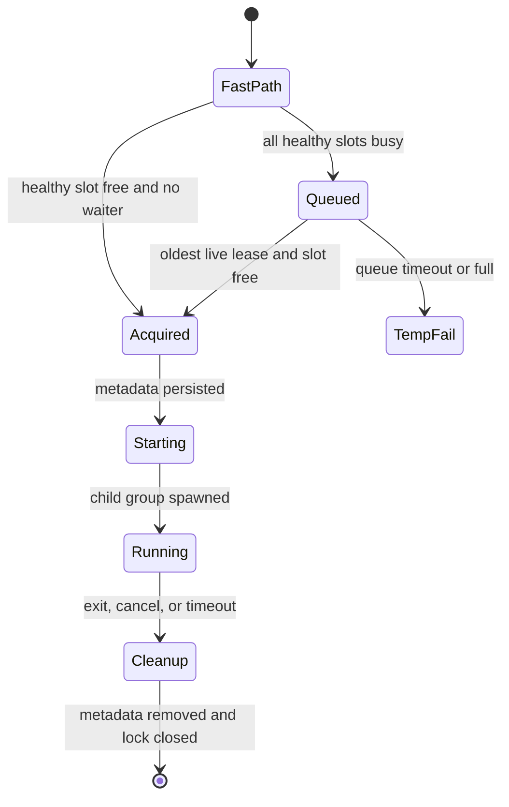

# Architecture

## Design constraints

Agent Governor optimizes for a small failure surface: one native binary, no daemon, no async
runtime, no privileged component, and no network access. Once a workload is classified as heavy,
every internal error fails closed for that workload. Before that boundary, malformed or unsupported
host/shell input passes through unchanged.

## Components

| Component | Contract |
|---|---|
| `hook` | Bounded JSON input, host-specific output, preserved unknown fields, stdout protocol only |
| `hook::rtk` | Direct argv spawn, bounded output, deadline, explicit exits 0/1/2/3 |
| `shell` | Bash CST with byte spans, conservative rules, insertion-only rewrite |
| `scheduler` | Stable slot inodes, short queue lock, bounded leases, approximate FIFO |
| `supervisor` | Inherited I/O, child process group, signals, execution timeout, exact exit mapping |
| `install` | Absolute paths, install lock, cross-agent rollback, exact backup restore or surgical unpatch |
| `doctor/status` | Read-only, versioned JSON plus concise human output |

## Admission state



The slot lock is authoritative. Active metadata protects against a supervisor killed while its child
continues. Corrupt metadata quarantines only that slot. The other slot remains usable at capacity 2.

## Shell rewrite invariant

The parser identifies the byte offset of a simple command's executable. The rewriter inserts only a
constant prefix at that offset, applying insertions from the largest offset to the smallest. It never
serializes the shell tree. Removing all inserted prefixes reconstructs the exact candidate input.

RTK is evaluated independently. A candidate is accepted only when each command differs by one added
`rtk` executable token and its command count, control-operator frame, classifications,
heavy-command count, and background placement match the original. Candidates involving redirection
changes are conservatively discarded. A rejected or timed-out candidate never bypasses governance:
the original command is classified and wrapped.

## Runtime layout

```text
~/Library/Application Support/agent-gov/runtime/
  schema-version
  queue.lock
  drain.flag
  capacity
  slots/slot-0.lock
  slots/slot-1.lock
  active/slot-0.json
  active/slot-1.json
  waiters/<timestamp>-<random>.lease
  cooldowns/
```

Directories are `0700`; files are `0600`. Slot files are created once and never rotated during
normal operation. On macOS, the runtime is supported only when `statfs(2)` reports `MNT_LOCAL` for
the runtime path (or its nearest existing ancestor during first-run creation). This kernel property,
not a filesystem-name allowlist, is the admission boundary. Agent Governor checks it before creating
scheduler state and again after creating the runtime directory. A missing `MNT_LOCAL` flag fails
closed before any recognized heavy workload starts.

## Known preview gaps

- TTY foreground process-group transfer is exercised with a pseudo-terminal on both hosted Mac
  architectures; physical IDE-terminal validation remains required.
- `cancel` uses a private per-job Unix socket and never signals a PID read from metadata. Automated
  termination of a live orphan still requires macOS process-start identity and remains disabled.
- Cursor hook schemas evolve quickly. `doctor` must be run after every Cursor update.
