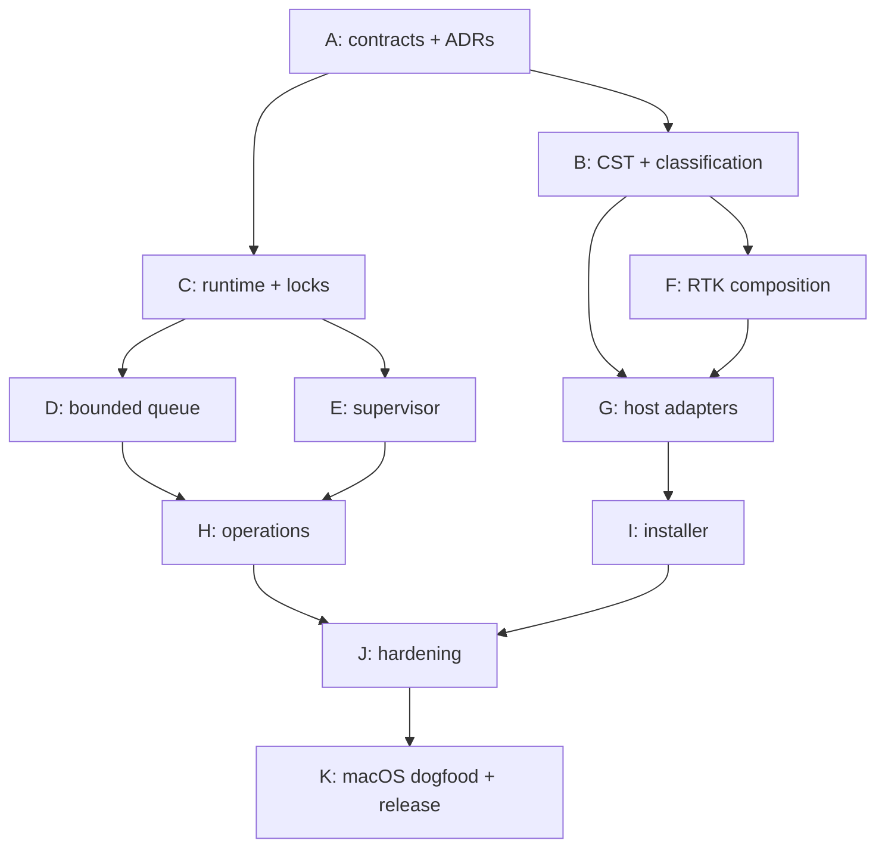

# Implementation graph

The project uses graph engineering: nodes have explicit prerequisites, outputs, and gates. A node is
not considered complete because an agent stopped producing code; it is complete only when its gate
passes.

| Node | Gate | State in v0.1.0 |
|---|---|---|
| A | Current Claude/RTK contracts and runner labels validated; ADRs committed | Complete |
| B | Tier 0/1 tests, byte-preservation property, idempotence, unsafe background denial | Complete |
| C | Private runtime, stable lock files, capacity 1/2 validation | Complete |
| D | Eight-process integration proves concurrency never exceeds 1/2 | Complete |
| E | Direct argv, inherited I/O, process group, TERM/KILL timeout, status propagation | Complete |
| F | Missing/hung RTK cannot bypass governor; exits 0/1/2/3 modeled | Complete |
| G | Unknown fields preserved; Claude permission not elevated; Cursor always valid JSON | Complete |
| H | status, cancel-safe refusal, drain/resume, transactional capacity | Complete |
| I | Idempotent user hooks, absolute paths, backup, surgical uninstall | Complete |
| J | Linux test gate, clippy, property tests, audit workflows, SBOM workflow | In progress until CI |
| K | macOS arm64/Intel CI, real Claude/Cursor/RTK dogfood, A/B benchmark | Required for v1.0 |

## Requirement traceability

Each pull request should list the FR/NFR IDs it changes. The initial implementation covers the core
of FR-001–015, FR-020–034, FR-040–055, FR-057–068, and the performance/security constraints that can
be verified without a target Mac. Requirements involving host-version probes, TTY behavior, process
start identity, 24-hour stress, signing/notarization, and real endpoint measurements remain release
gates rather than simulated claims.
