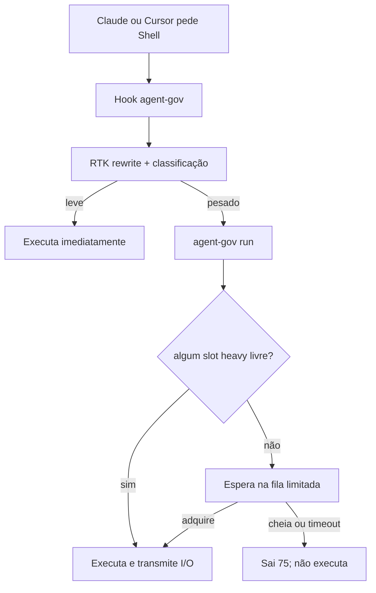
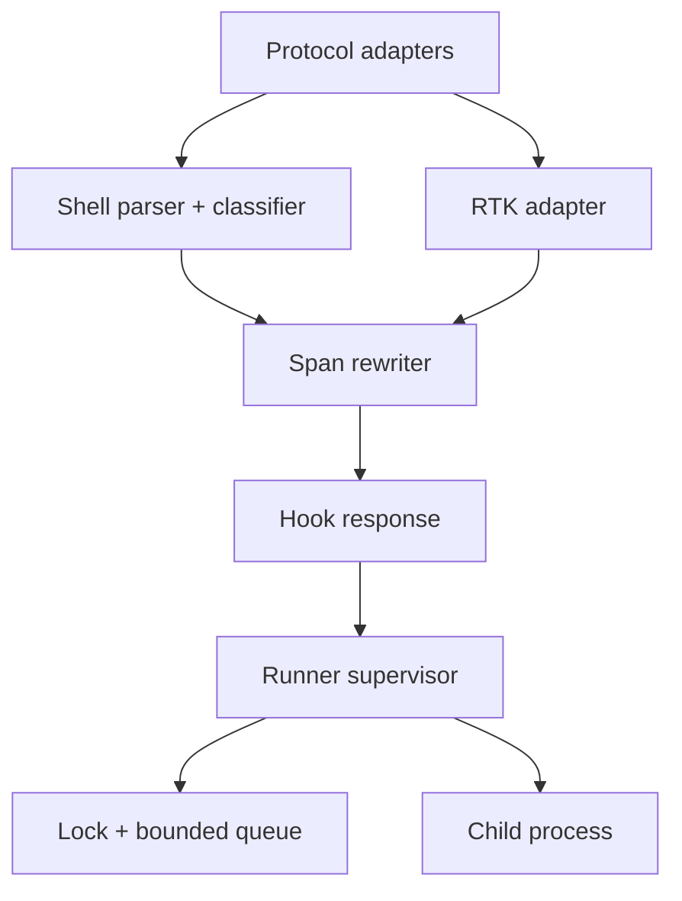
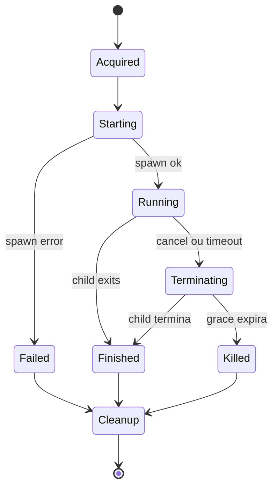

# Agent Governor

## PRD, arquitetura e plano de implementação

| Campo | Valor |
|---|---|
| Nome de trabalho | `agent-gov` (nome definitivo em aberto) |
| Status | Proposta pronta para implementação |
| Versão do documento | 1.1 |
| Data | 2026-08-02 |
| Plataforma inicial | macOS, Apple Silicon e Intel |
| Integrações iniciais | Claude Code, Cursor e RTK |
| Público deste documento | Agente ou engenheiro responsável pela implementação |

> Instrução ao implementador: trate os requisitos marcados como **MUST** como contrato do MVP. Não amplie o escopo para execução remota, daemon, scheduler adaptativo ou alteração de ferramentas corporativas de segurança. Quando houver dúvida, escolha a alternativa mais conservadora para semântica do comando e mais restritiva para uma carga já reconhecida como pesada.

### Revisão 1.1

- explicita que o total de eventos pode ser semelhante; o governador reduz pico e WIP, não trabalho por definição;
- troca a capacidade fixa `1` por pool lightweight configurável `1`–`2`, com default `1`;
- define escolha por SLO de responsividade/memória e, depois, throughput;
- amplia benchmark, status, orphan guard, rollout e critérios de aceite para múltiplos slots.

---

## 1. Resumo executivo

O `agent-gov` será um binário nativo e independente que limita a concorrência de comandos de desenvolvimento pesados disparados por agentes locais. Ele atenderá Claude Code e Cursor por meio de um único hook de pré-execução por produto e continuará usando o RTK para reescrever e compactar a saída dos comandos, sem fork, patch ou dependência de mudanças no projeto RTK.

O problema principal é um Mac corporativo que executa simultaneamente quatro a seis agentes, possivelmente com subagentes. Builds, testes e instalações criam muitos processos e acessos a arquivos. Produtos como Endpoint Security/EDR, DLP, proxy e controle de privilégio podem inspecionar esses eventos. Mesmo que a cadeia exata dos produtos não seja estritamente serial, a multiplicação de eventos concorrentes pode saturar CPU, memória, disco, filas do kernel e os próprios agentes de segurança, tornando a máquina lenta ou não responsiva.

A política inicial será deliberadamente simples:

- um pool global com capacidade configurável entre **um e dois comandos pesados**, compartilhado por Claude, Cursor, seus subagentes e todos os worktrees executados pelo mesmo usuário do macOS;
- capacidade padrão `1`, escolhida como postura conservadora; capacidade `2` deve ser habilitada quando o benchmark mostrar ganho de throughput sem violar os limites de responsividade e memória;
- comandos leves continuam sem fila;
- quando todos os slots habilitados estão ocupados, novos comandos pesados esperam em uma fila pequena e limitada;
- fila cheia ou tempo de espera esgotado produz erro temporário explícito e **nunca** executa a carga pesada por fora do governador;
- cada processo que mantém um slot é um supervisor mínimo que transmite I/O, sinais e status de saída, sem capturar a saída do build;
- não existe daemon, banco, serviço privilegiado, polling de CPU nem modificação/desativação de Palo Alto, Zscaler, DLP, BeyondTrust ou controles similares.

O MVP será um limitador global por slots idênticos, não um orquestrador geral. Ele suporta capacidade `1` ou `2` sem daemon. Pools ponderados, capacidade acima de `2`, prioridade de CPU/I/O e limitação dos workers internos de Maven/Gradle/Jest só serão avaliados depois de medições reais.

---

## 2. Contexto e problema

### 2.1 Cenário operacional

- Mac corporativo com múltiplos produtos de segurança e observabilidade no endpoint.
- Quatro a seis agentes locais trabalhando ao mesmo tempo no Cursor e/ou Claude Code.
- Agentes podem criar subagentes e disparar comandos sem coordenação central.
- Cargas frequentes: `yarn`, `npm`, `pnpm`, Maven, Gradle, compilação, lint, typecheck e testes.
- Execução remota foi explicitamente excluída desta fase.
- RTK já é desejado para reduzir a saída que chega ao contexto do agente.

### 2.2 Hipótese causal

O gargalo não precisa estar somente no processo de build. Uma carga pesada dispara milhares de aberturas, leituras, escritas, criações e execuções. Com vários builds concorrentes, a **taxa instantânea** de eventos observados pelos produtos de segurança e a quantidade de trabalho simultaneamente em andamento crescem rapidamente. Esses produtos também competem por CPU, memória e I/O. O resultado pode ser latência alta, pressão de memória, swap, contenção do filesystem e baixa responsividade da interface.

O `agent-gov` não presume que seis builds geram menos trabalho total quando executados sequencialmente. Sem contenção, os mesmos seis builds tendem a produzir aproximadamente o mesmo total de eventos nos dois cenários; apenas a distribuição no tempo muda. Se o sistema fosse perfeitamente linear, o tempo até o último build poderia ser igual ou até melhor em paralelo.

O benefício esperado vem de limitar o **WIP (work in progress)** antes que as árvores de processos sejam criadas. Isso reduz o pico de eventos, processos, threads, heaps, arquivos abertos e buffers. Pode também reduzir trabalho adicional não linear provocado por context switches, cache misses, garbage collection concorrente, retries, timeouts, locks, swap e thrashing. Portanto, o governador é primeiro um controle de qualidade de serviço e responsividade; ganho de throughput é uma hipótese a medir, não uma promessa.

Uma fila interna do Endpoint Security ou de um produto corporativo atua por evento, depois que os builds e seus workers já existem. Ela pode aplicar backpressure e fazer o último evento terminar em tempo semelhante ao cenário governado, mas não limita o WIP no nível de job. Se essa fila já fornecer backpressure perfeito e o restante do sistema escalar linearmente, o governador não melhora o makespan e pode até piorá-lo. Essa possibilidade faz parte obrigatória do benchmark.

O `agent-gov` não tenta diagnosticar nem alterar a política dos produtos de segurança. Ele controla a variável disponível ao usuário: quantas cargas pesadas iniciadas pelos agentes podem permanecer ativas ao mesmo tempo.

### 2.3 Problema a resolver

> Como permitir vários agentes autônomos trabalhando localmente, em Claude e Cursor, limitando cargas pesadas a uma capacidade pequena e medida (`1` ou `2`), sem perder o RTK, sem alterar os agentes de segurança e sem adicionar uma infraestrutura pesada ou frágil?

---

## 3. Objetivos, não objetivos e métricas

### 3.1 Objetivos do produto

1. Impedir que a quantidade de comandos pesados governados exceda a capacidade configurada (`1` ou `2`) no mesmo usuário do macOS.
2. Integrar de forma transparente com Claude Code, Cursor e seus subagentes.
3. Preservar o benefício de reescrita/filtragem do RTK sem fork e sem PR upstream.
4. Manter comandos leves rápidos e independentes da fila de builds.
5. Ser seguro diante de crash, cancelamento, timeout, reboot, RTK ausente e configuração inválida.
6. Preservar stdin, stdout, stderr, diretório, ambiente, redirecionamentos e status de saída sempre que o comando for suportado.
7. Ser simples de instalar, diagnosticar, atualizar e remover sem privilégios administrativos.
8. Gerar overhead desprezível em comparação com a carga que controla.

### 3.2 Não objetivos do MVP

- execução remota, distribuída ou em cloud;
- desativar, contornar, reconfigurar ou interferir em ferramentas corporativas de segurança;
- governar todos os processos da máquina ou comandos iniciados fora dos hooks;
- daemon, LaunchAgent, LaunchDaemon, socket local, SQLite ou serviço persistente;
- parser e reescritor completo de toda a linguagem Bash/Zsh;
- isolamento de alterações simultâneas no mesmo workspace;
- deduplicar automaticamente builds idênticos ou compartilhar a saída entre agentes;
- limitar automaticamente workers internos de todas as ferramentas;
- interface gráfica, dashboard ou telemetria remota;
- garantia entre usuários diferentes do macOS. O lock do MVP é global por usuário. No cenário de um único usuário interativo, isso equivale na prática ao Mac usado pelos agentes.

### 3.3 Indicadores de sucesso

| Indicador | Meta do MVP |
|---|---:|
| Concorrência pesada governada | entre `0` e a capacidade configurada; nunca acima dela |
| Comandos pesados que escapam após timeout/erro do scheduler | `0` |
| Overhead p95 do hook, sem o subprocesso RTK | ≤ 3 ms em Mac Apple Silicon de referência |
| Overhead p95 do hook com RTK saudável | ≤ 15 ms ou no máximo 5 ms acima do hook RTK substituído, o que for maior |
| CPU de um processo aguardando slot | próxima de 0%; < 0,1% em amostra de 60 s |
| RSS do supervisor ativo | ≤ 8 MiB desejável; ≤ 15 MiB obrigatório |
| Tamanho do binário universal, stripped | meta ≤ 12 MiB; justificar se maior |
| Fila máxima padrão | 8 esperando, além do ativo |
| Recuperação após crash/reboot | automática, sem limpeza manual de lock |
| Compatibilidade | fixtures e testes reais para versões suportadas de Claude e Cursor |
| Tempo até primeiro resultado | medir e comparar entre capacidades `1`, `2`, `4` e `6` |
| Tempo médio e makespan | não assumir melhora; selecionar capacidade pelo benchmark |
| Latência p95 de comando leve | SLO definido na Fase 0 e respeitado na capacidade escolhida |
| Memory pressure/swap | dentro do SLO definido na Fase 0 |

### 3.4 Resultado operacional esperado

O throughput de um conjunto de builds pode aumentar ou diminuir dependendo da contenção atual. O objetivo primário é manter a máquina utilizável; dentro dessa restrição, maximizar o throughput. A regra de decisão é lexicográfica:

1. eliminar capacidades que violem os SLOs de responsividade, latência de comandos leves, memory pressure ou swap;
2. entre as capacidades restantes, escolher a que apresentar melhor combinação de makespan e tempo médio de conclusão;
3. na ausência de evidência confiável, usar `1`.

Assim, `1` é o default seguro, não uma afirmação de que sequencial sempre termina mais rápido. `2` pode ser o perfil recomendado do Mac-alvo se o benchmark mostrar que mantém os SLOs e aproveita paralelismo útil.

---

## 4. Princípios e decisões arquiteturais

### 4.1 Decisões fechadas para o MVP

| Decisão | Escolha | Razão |
|---|---|---|
| Linguagem | Rust, binário nativo único | startup baixo, sem runtime externo e boa integração com syscalls |
| Concorrência pesada | `1` ou `2`; default `1` | permite escolher o melhor ponto sob SLO sem abandonar simplicidade |
| Coordenação | um `flock(2)` exclusivo por slot estável | kernel libera em crash e não exige daemon |
| Dono do slot lock | supervisor `agent-gov run` | evita vazar o descritor para Gradle daemons e outros descendentes |
| Hook | um hook composto por agente | evita disputa entre múltiplos hooks que alteram o mesmo input |
| RTK | subprocesso `rtk rewrite` | composição pública, sem fork ou dependência upstream |
| Fila | pequena, limitada, com leases; justiça aproximada | evita tempestade de processos sem criar scheduler persistente |
| I/O do build | herdado diretamente | streaming real e memória constante |
| Configuração | defaults compilados; arquivo opcional | reduz file opens no caminho quente |
| Política de erro | fail-open para parsing/hook desconhecido; fail-closed para pesado reconhecido que não pode adquirir permissão | não quebra comandos desconhecidos e nunca libera um build conhecido após falha do governador |
| Logs | mínimos e locais; comandos redigidos | menor I/O, privacidade e menor interação com DLP |

### 4.2 Por que não usar um daemon no MVP

Um daemon permitiria fila estritamente justa, estado centralizado e políticas adaptativas, mas acrescentaria instalação, protocolo IPC, ciclo de vida, compatibilidade de versões, recuperação e outro processo permanente. Com um ou dois slots idênticos, locks de kernel e no máximo oito waiters resolvem o problema com menos estados de falha.

Um daemon só deve ser reconsiderado se medições mostrarem necessidade real de: múltiplos pools ponderados, reserva de capacidade, fila estritamente justa entre dezenas de clientes ou coalescência de jobs.

### 4.3 Por que o supervisor não faz `exec` direto

O processo do governador deve continuar vivo enquanto o filho executa. Ele abre e mantém o lock do slot adquirido com `FD_CLOEXEC`, inicia o filho e espera por ele. Assim, o descritor não passa para Gradle daemons, watchers ou processos que se destacam. Se fosse herdado e o governador simplesmente fizesse `exec`, um daemon poderia manter o slot indefinidamente.

O custo de um processo supervisor adormecido por build é pequeno e previsível. Essa é a troca correta entre robustez e peso.

### 4.4 O que acontece com o hook atual do RTK

A funcionalidade do RTK continua, mas sua entrada separada na configuração do Claude/Cursor deixa de existir. O fluxo anterior era “hook RTK → `rtk rewrite`”. O novo fluxo é “hook `agent-gov` → `rtk rewrite` → governança”. Portanto, não são empilhados dois rewriters concorrentes e não há fork do RTK.

No caminho de um comando leve, o custo adicional em relação a um hook RTK nativo é um único processo Rust curto (`agent-gov`) que chama o mesmo `rtk rewrite`. No caminho pesado, existe também um supervisor adormecido durante o build. Os budgets de performance deste PRD tornam esse custo mensurável e bloqueiam o release se ele for material.

### 4.5 Alternativas avaliadas

| Alternativa | Por que não é a solução principal |
|---|---|
| Estender/forkar RTK | RTK é excelente para rewrite e filtragem de saída, mas não oferece um contrato público de plugin pré-execução para scheduler local. `rtk rewrite` já é a fronteira pública suficiente; fork/PR criaria acoplamento desnecessário. |
| [Remote Compilation Helper](https://github.com/Dicklesworthstone/remote_compilation_helper) | Intercepta builds de agentes, mas os envia a workers remotos e enfatiza Cargo/GCC. Execução remota foi excluída e Node/Maven são requisitos centrais. |
| [GNU `sem`](https://www.gnu.org/software/parallel/sem.html) | É um semáforo maduro e poderia formar um protótipo, mas não resolve adapters, RTK, classificação, preservação de protocolo, orphan guard e instalação transacional; também adiciona shell/dependência ao caminho crítico. |
| [Pueue](https://github.com/Nukesor/pueue) | Possui fila rica, porém usa daemon e tarefas destacadas. Esse lifecycle diverge do tool call síncrono de Claude/Cursor, que precisa receber streaming, cancelamento e exit do mesmo processo. |
| `nice`/`taskpolicy` | Alteram prioridade, não impedem dois builds de gerarem eventos simultaneamente. Podem complementar uma fase futura. |
| Apenas instruções no prompt | Agentes/subagentes em modo autônomo podem ignorar ou interpretar de formas diferentes; não fornece exclusão mútua. |

Conclusão: implementar a fina camada ausente e compor ferramentas existentes é menor e mais resiliente do que adaptar um task manager geral ou depender de mudanças upstream.

---

## 5. Experiência do usuário

### 5.1 Fluxo nominal



### 5.2 Quando todos os slots estão ocupados

1. O novo agente inicia o comando normalmente.
2. O hook reescreve o segmento pesado para passar pelo `agent-gov run`.
3. Se nenhum dos slots configurados estiver livre, o runner informa uma única vez no stderr que está aguardando, incluindo posição aproximada e limite de espera, sem imprimir o comando completo.
4. Ao liberar um slot, o runner informa que o adquiriu e executa o comando.
5. Se a fila estiver cheia ou o tempo acabar, retorna `EX_TEMPFAIL` (`75`) e uma mensagem com `retry-after`. O comando original não é executado.

Exemplo de mensagem:

```text
agent-gov: heavy slot busy; queued (3/8), wait limit 5m
agent-gov: slot acquired after 42.3s; starting npm-test
```

Exemplo de timeout:

```text
agent-gov: temporary failure: heavy slot unavailable after 5m; command was not started; retry after 30s
```

### 5.3 Comandos de administração

```text
agent-gov install --agents claude,cursor --with-rtk
agent-gov doctor
agent-gov doctor --repair-runtime
agent-gov status
agent-gov classify -- "cd app && npm run build"
agent-gov hook-check claude < fixture.json
agent-gov config set capacity 2 --drain
agent-gov cancel <job-id>
agent-gov drain
agent-gov resume
agent-gov uninstall
```

O comando `--with-rtk` significa “integrar com o RTK já instalado”. O instalador não deve baixar nem atualizar RTK sem uma opção separada, explícita e futuramente especificada.

---

## 6. Requisitos funcionais

### 6.1 Hooks e protocolos

**FR-001 — Hook único.** O instalador MUST registrar exatamente um hook `agent-gov` que possa alterar o comando em cada agente selecionado.

**FR-002 — Claude.** O hook MUST atender `PreToolUse` com matcher `Bash`, ler JSON de stdin e produzir o formato suportado pela versão instalada.

**FR-003 — Cursor.** O hook MUST atender `preToolUse` com matcher `Shell`, ler JSON de stdin e sempre produzir JSON válido; em pass-through, produzir `{}` se esse for o contrato da versão suportada.

**FR-004 — Subagentes.** A instalação MUST ser em escopo de usuário, não apenas de projeto, para que chamadas de Bash/Shell de subagentes atravessem o mesmo hook quando a plataforma propagar hooks para eles.

**FR-005 — Preservação do input.** Ao produzir `updatedInput`/`updated_input`, o adapter MUST copiar o objeto completo recebido e alterar apenas `command` e, quando explicitamente suportado, `timeout`. Campos como `description` e `run_in_background` não podem desaparecer.

**FR-006 — Sem elevação implícita.** Por padrão, uma reescrita não deve converter a decisão de permissão do agente em `allow`. O adapter preserva a política do host. Decisões `ask` ou `deny` vindas do contrato RTK devem ser mapeadas explicitamente. Um modo `rtk_compat` que reproduza `allow` pode existir somente como opt-in documentado.

**FR-007 — Stdout reservado.** Nos subcomandos `hook`, stdout MUST conter somente o protocolo do agente. Diagnóstico vai para stderr. Qualquer panic/erro deve ser capturado antes de poluir stdout.

**FR-008 — Prazo do hook.** O hook MUST ter deadline interno de 1 s e ser registrado no host com teto de 5 s. Em operação normal, não deve chegar perto desses limites.

**FR-009 — Command string do host.** Quando o host aceitar somente uma command string para registrar o hook, o instalador MUST aplicar quoting POSIX comprovado ao path e aos argumentos, rejeitar NUL/newline e testar paths com espaço e aspas. A execução interna de RTK e workloads continua sendo por argv direto.

### 6.2 Integração RTK

**FR-010 — Composição.** O hook chama diretamente o binário absoluto do RTK como `rtk rewrite <command>`, sem shell intermediário.

**FR-011 — Timeout RTK.** O subprocesso RTK tem timeout padrão de 750 ms, configurável entre 100 ms e 2 s. Em timeout: matar, aguardar reap, ignorar saída parcial e continuar com o comando original.

**FR-012 — Códigos RTK.** O adapter deve tratar:

| Exit do `rtk rewrite` | Significado esperado | Ação do `agent-gov` |
|---:|---|---|
| `0` | rewrite + allow | aceitar stdout válido; preservar permissão do host por padrão |
| `1` | sem equivalente | usar original |
| `2` | deny | emitir deny no protocolo do agente; não executar |
| `3` | rewrite + ask | aceitar stdout válido e emitir ask |
| outro/sinal/timeout | falha | usar original e continuar governando se pesado |

**FR-013 — Validação.** A saída RTK só é aceita quando não vazia, UTF-8 válida, sem NUL, dentro do limite de 64 KiB e parseável pelo pipeline seguro. Uma saída inválida nunca substitui o original. Em compounds com pipe/redirecionamento, aceitar a reescrita apenas para versões RTK validadas pelo corpus sem mudança de operadores, redirects e segmentos produtores; caso contrário, governar o original sem RTK naquele segmento.

**FR-014 — Independência.** A classificação do comando original acontece mesmo se RTK estiver ausente, travar ou falhar. RTK não pode ser um bypass do governador.

**FR-015 — `RTK_DISABLED`.** `RTK_DISABLED=1` desativa somente a reescrita RTK. Um comando pesado continua governado.

**FR-016 — Compatibilidade.** `doctor` MUST mostrar path e versão do RTK, executar probes de exits `0/1/3` quando disponíveis e alertar sobre versões não validadas. Não deve exigir fork ou código privado do RTK.

### 6.3 Parsing, classificação e reescrita

**FR-020 — Parsing estruturado.** A implementação MUST usar parser/CST de shell com spans de bytes, preferencialmente `tree-sitter-bash`, e nunca regex sobre a linha inteira para fazer reescrita estrutural.

**FR-021 — Alteração por inserção.** A reescrita deve inserir um prefixo constante imediatamente antes do executável do simple command, preservando o restante dos bytes. Não deve reserializar todo o shell nem envolver automaticamente o comando em `sh -c`.

Exemplo:

```text
cd app && NODE_ENV=test npm run build >build.log 2>&1
```

torna-se, de forma conceitual:

```text
cd app && NODE_ENV=test /ABS/agent-gov run --pool heavy --owner 7f2a -- npm run build >build.log 2>&1
```

**FR-022 — Múltiplos segmentos.** Em `npm ci && npm test`, cada simple command reconhecido recebe seu próprio wrapper. As inserções são aplicadas do maior para o menor byte offset. Outro job pode entrar entre os dois segmentos; atomicidade do compound não faz parte do MVP.

**FR-023 — RTK reescrito.** Quando RTK transforma `npm test` em `rtk npm test`, o wrapper deve ficar antes do `rtk`, para que o slot adquirido cubra o filtro e o processo real: `agent-gov run -- rtk npm test`.

**FR-024 — Fallback seguro.** Se o original é pesado e a saída RTK não pode ser correlacionada a uma carga pesada equivalente, descartar a reescrita RTK para esse segmento e governar o original. Governança tem precedência sobre compactação.

**FR-025 — Sintaxe não suportada.** Heredoc, aritmética complexa, expansão dinâmica do executável, AST com erro, construções multiline ambíguas e outras sintaxes não comprovadamente seguras passam sem modificação e geram diagnóstico apenas em debug. Essa limitação deve aparecer no `doctor`/documentação.

**FR-026 — Background explícito.** Uma carga pesada reconhecida terminada por `&` deve ser negada por padrão com instrução para executá-la em foreground. O campo nativo `run_in_background` do agente pode ser preservado, pois o host ainda acompanha o processo wrapper. Watchers e servidores conhecidos pertencem à classe `service` e não usam o slot `heavy` no MVP.

**FR-027 — Wrappers.** O normalizador deve entender, com testes, assignments de ambiente e wrappers comuns como `env`, `command`, `time`, `nice` e `rtk`. Não deve atravessar `sudo`, `xargs`, shell dinâmico ou wrappers desconhecidos.

**FR-028 — Limites.** Inputs com mais de 64 KiB, NUL ou profundidade AST acima de um limite defensivo passam sem reescrita; nenhum path deve causar alocação sem limite ou recursão não controlada.

### 6.4 Política de classificação inicial

O classificador retorna uma destas classes:

| Classe | Comportamento |
|---|---|
| `light` | executa imediatamente |
| `heavy` | exige um slot do pool `heavy` |
| `service` | passa sem lock; identificado como longa duração |
| `unknown` | passa sem lock |
| `unsafe-background-heavy` | nega por padrão |

**FR-030 — Tier 0 obrigatório.** Antes do primeiro release, classificar:

| Ecossistema | Heavy | Service/exclusão conhecida |
|---|---|---|
| Maven | `mvn`, `mvnw`, `./mvnw`: `clean`, `compile`, `test`, `package`, `verify`, `install` | `spring-boot:run`, goals explicitamente contínuos |
| Gradle | `gradle`, `gradlew`, `./gradlew`: `clean`, `assemble`, `build`, `check`, `test`, tasks terminando em `Test` | `--continuous`, servidores |
| npm | `install`, `ci`, `test`, `run build`, `run test`, `run lint`, `run typecheck` | `start`, `run dev`, scripts com `watch` |
| yarn | `install`, `test`, `build`, `lint`, `typecheck`, `run` com nomes pesados | `dev`, `start`, `watch` |
| pnpm | `install`, `test`, `build`, `lint`, `typecheck`, `run` com nomes pesados | `dev`, `start`, `watch` |

**FR-031 — Tier 1 para v1.0.** Adicionar por regras separadas: `cargo build/test/check/clippy`, `make`, `ninja`, `bazel build/test`, `go build/test`, `dotnet restore/build/test`, `xcodebuild`, `swift build/test`, `docker build` e `docker compose build`.

**FR-032 — Normalização.** Comparar pelo basename do executável, mantendo distinção de argumentos. `/opt/homebrew/bin/npm` é `npm`; um executável calculado por variável continua `unknown`.

**FR-033 — Scripts de projeto.** Nomes desconhecidos de `npm run`, Yarn e pnpm não devem ser adivinhados. O usuário pode criar regras globais explícitas por prefixo de argv. Configuração local ao repositório não é carregada automaticamente.

**FR-034 — Explicabilidade.** `agent-gov classify -- <string>` deve informar classe, regra, segmento, confiança e se o comando seria reescrito, sem executá-lo.

### 6.5 Scheduler, fila e runner

**FR-040 — Pool global.** O MVP possui um único pool `heavy` de slots idênticos, com capacidade configurável `1` ou `2` e default `1`. Valores fora desse intervalo devem ser rejeitados, nunca truncados ou parcialmente aplicados.

**FR-041 — Localização.** O runtime fica em `~/Library/Application Support/agent-gov/runtime`, diretório `0700`, em filesystem local. `doctor` alerta e recusa enforcement se o diretório estiver em NFS/SMB ou se owner/permissões forem inseguros.

**FR-042 — Locks de slot.** Usar `flock(LOCK_EX | LOCK_NB)` sobre arquivos de inode estável `slots/slot-0.lock` e `slots/slot-1.lock`. Um job adquire exatamente um slot. Os arquivos não devem ser apagados ou recriados durante operação, update ou limpeza.

**FR-043 — Supervisor.** Após adquirir um slot, `agent-gov run` permanece vivo, marca o descritor do slot `FD_CLOEXEC`, inicia o filho sem shell adicional, herda stdin/stdout/stderr e espera o término.

**FR-044 — Fast path.** O runner obtém `queue.lock`, poda leases stale, verifica `drain` e orphans e, se não houver waiters vivos, tenta os slots habilitados em ordem rotacionada antes de criar um waiter. Se adquirir um, não cria lease de fila. Essa curta seção crítica impede que um job novo ignore drain ou corte uma fila já existente.

**FR-045 — Admissão limitada.** Quando ocupado, o runner cria um lease único em `waiters/` sob um `queue.lock` de curta duração. O lease fica aberto e locked pelo waiter. Leases cujo lock pode ser adquirido são stale e podem ser removidos. O total padrão é no máximo `8` waiters vivos.

**FR-046 — Limite por owner.** Por padrão, apenas um job pesado pode ficar esperando por owner/session. O hook passa um hash curto e seguro de `session_id`/`conversation_id` quando o host fornece esse dado. Sem ID, o limite é best-effort.

**FR-047 — Justiça.** O MVP oferece justiça aproximada, não FIFO estrito. Backoff com jitter e pequeno limite de fila devem evitar hot spin e reduzir starvation. Não implementar ticket scheduler frágil antes de existir evidência de starvation.

**FR-048 — Timeout de fila.** Padrão inicial: `5m`, configurável entre `5s` e `15m`, contado por relógio monotônico contínuo que inclui sleep. Ao expirar: remover lease, imprimir erro temporário e sair `75` sem executar. Aumentar a capacidade não altera automaticamente esse timeout.

**FR-049 — Cooldown.** Após fila cheia ou timeout, responder com `retry-after` padrão de `30s`. Uma pequena marca por owner/fingerprint pode fazer retries imediatos falharem rápido, com retenção limitada e limpeza oportunista. Não registrar o comando em claro.

**FR-050 — Timeout de execução.** Padrão `30m`, configurável entre `1m` e `4h`. Ao expirar, enviar `SIGTERM` ao grupo do filho, aguardar 5 s e então `SIGKILL`. O limite externo do agente pode encerrar antes.

**FR-051 — Cancelamento em fila.** `SIGINT`/`SIGTERM` durante a espera remove o lease e retorna sem iniciar o comando.

**FR-052 — Cancelamento ativo.** Durante execução, sinais de término são encaminhados ao grupo do filho. Depois do grace period, o grupo é finalizado. `SIGWINCH` deve ser encaminhado quando relevante.

**FR-053 — TTY/job control.** Se stdin for TTY, o supervisor deve preservar job control: criar process group para o filho, transferir temporariamente o foreground terminal group quando seguro e restaurá-lo. Em pipes/non-TTY, usar process group separado sem manipular terminal.

**FR-054 — Exit exato.** Saída normal do filho é propagada. Para filho morto por sinal, o supervisor faz cleanup, restaura o handler default e sinaliza a si próprio com o mesmo sinal; fallback documentado é `128 + sinal` se a plataforma impedir.

**FR-055 — Erros de spawn.** Comando não encontrado retorna `127`; não executável/formato inválido retorna `126`; falha interna do governador retorna código `sysexits` apropriado e nunca executa pesado sem lock.

**FR-056 — Metadata e orphan guard.** O lock do kernel de cada slot é a autoridade primária. Antes de spawn, o supervisor MUST persistir `active/slot-N.json` válido; depois do spawn, atualiza PID/PGID e identidade de início do filho. Se o lock daquele slot estiver livre, mas essa identidade apontar para filho/grupo ainda vivo de um supervisor morto, somente esse slot fica em quarentena. Outros slots saudáveis continuam utilizáveis. Metadata stale só é descartada depois de comprovar que supervisor e filho/grupo terminaram. Falha ao persistir metadata antes do spawn é fail-closed para o slot adquirido.

**FR-057 — Reentrância.** Um processo já sob `agent-gov` não deve readquirir o mesmo pool por shims ou invocação indireta. O supervisor exporta um token/marker de execução para os descendentes; o bypass vale somente para reinvocação legítima do wrapper, não para comandos arbitrários vindos do hook.

**FR-058 — Cancel seguro.** `status` atribui um `job-id` opaco a cada workload ativo. `cancel <job-id>` MUST resolver exatamente um slot e validar PID, process start time, owner e path do supervisor antes de sinalizar. Se o supervisor morreu e o orphan guard identifica o grupo do filho, pode sinalizar esse grupo somente após a mesma validação; diante de PID reuse ou dúvida, recusar. Não aceitar `cancel active` quando mais de um slot puder existir.

**FR-059 — Drain.** `drain` cria o estado sob `queue.lock`, bloqueia novas admissões e deixa ativo/waiters existentes terminarem. `drain --cancel-waiters` pode ser fase posterior. `resume` remove o estado atomicamente. Update/uninstall devem usar drain ou recusar enquanto busy.

**FR-059A — Mudança de capacidade.** Alterar `capacity` exige `drain` e pool totalmente idle. O comando de configuração escreve o valor atomicamente e só então faz `resume`. Isso impede que processos concorrentes enxerguem quantidades diferentes de slots durante uma execução.

### 6.6 Instalação, update e remoção

**FR-060 — Instalação sem root.** Binário padrão em `~/.local/bin/agent-gov`; hooks usam path absoluto resolvido. Nenhum `sudo`, LaunchDaemon ou alteração de system extension.

**FR-061 — Transação.** Antes de editar configurações, validar JSON, obter lock de instalação, criar backup `0600`, escrever arquivo temporário no mesmo diretório, `fsync` e fazer rename atômico.

**FR-062 — Idempotência.** Rodar `install` repetidamente não duplica hooks, backups ou regras.

**FR-063 — Migração RTK.** O instalador remove o hook RTK separado somente se ele for reconhecido com alta confiança por path/comando conhecido. O binário e a configuração RTK permanecem. Hooks desconhecidos são preservados e reportados como conflito.

**FR-064 — Um modificador.** Se houver outro hook que pode retornar `updatedInput`, `doctor` deve alertar que duas reescritas podem competir. Não apagar automaticamente hooks desconhecidos.

**FR-065 — Managed hooks.** Detectar políticas do Claude que permitem somente managed hooks, como `allowManagedHooksOnly`, e relatar bloqueio. Não tentar contornar a política corporativa.

**FR-066 — Reexecução de `rtk init`.** `doctor` detecta se `rtk init` recolocou o hook separado e oferece comando de reparo; não corrige silenciosamente.

**FR-067 — Update seguro.** Substituir o binário atomicamente. Mudança incompatível de schema/runtime exige `drain`; update deve recusar enquanto houver ativo/waiters se não puder garantir compatibilidade.

**FR-068 — Uninstall.** Se arquivos não mudaram desde a instalação, restaurar bytes originais. Se mudaram, remover cirurgicamente apenas entradas do `agent-gov`, preservar mudanças posteriores e manter backup. Nunca apagar runtime enquanto busy.

---

## 7. Requisitos não funcionais

### 7.1 Performance e peso

**NFR-001.** Sem runtime async (`tokio`) no caminho principal.

**NFR-002.** Sem shell, `jq`, Python ou Node para implementar o hook.

**NFR-003.** Defaults de classificação devem ser compilados. O hook não lê arquivo de configuração no fast path padrão. Opções necessárias são passadas pelo registro do hook; regras customizadas habilitam explicitamente uma leitura de config.

**NFR-004.** O runner não captura a saída do build. Seus descritores apontam diretamente para os descritores recebidos.

**NFR-005.** Polling de lock usa backoff limitado, por exemplo 25 ms → 50 ms → 100 ms → teto de 500 ms, com jitter; deve responder rapidamente a sinal por self-pipe/kqueue.

**NFR-006.** Logs padrão são no máximo uma linha ao entrar na fila, uma ao adquirir e uma em erro. Sem heartbeat.

### 7.2 Confiabilidade

**NFR-010.** Toda syscall relevante trata `EINTR`.

**NFR-011.** Arquivos runtime são abertos com proteção contra symlink quando suportado, validados por `fstat`, owner e tipo regular.

**NFR-012.** Deadlines usam uma abstração de relógio testável. No macOS, preferir `mach_continuous_time` para que sleep/wake conte no timeout.

**NFR-013.** Nenhum caminho de erro depois de classificar `heavy` pode chamar o comando sem lock.

**NFR-014.** O hook sempre termina de maneira compatível com o host. Deny é comunicado por JSON válido, não por crash ou exit não documentado.

**NFR-015.** O binário deve suportar build `arm64` e `x86_64`; release pode fornecer universal binary após testes das duas arquiteturas.

### 7.3 Segurança e privacidade

**NFR-020.** O produto é um controle de carga, não uma fronteira de segurança. Isso deve estar explícito.

**NFR-021.** Nenhum comando completo, argumento, variável de ambiente, conteúdo de arquivo ou transcript é persistido por padrão.

**NFR-022.** Metadata contém somente ID aleatório, hash de owner, classe/rótulo genérico, PID, identidade de início do processo e timestamps.

**NFR-023.** O hook invoca RTK por argv direto e path absoluto; nunca concatena input do agente em um comando de shell.

**NFR-024.** A inserção no command string contém apenas path absoluto previamente validado, flags constantes e IDs hex/base32. O comando original permanece nos spans originais.

**NFR-025.** Configuração global é `0600`, diretórios `0700` e backups `0600`. Configuração de projeto não é confiável por padrão.

**NFR-026.** Nenhuma telemetria externa no MVP.

---

## 8. Arquitetura técnica

### 8.1 Componentes



| Componente | Responsabilidade |
|---|---|
| `hook/claude` | parse/validação e resposta Claude |
| `hook/cursor` | parse/validação e resposta Cursor |
| `rtk_adapter` | subprocesso, timeout, exits e validação |
| `shell` | CST, segmentos, wrappers, classificação e spans |
| `rewriter` | inserções seguras em ordem reversa |
| `scheduler` | lock, admissão, leases, cooldown e deadlines |
| `supervisor` | spawn, I/O, process groups, sinais e exits |
| `install` | patch transacional, backup, migração e uninstall |
| `doctor` | probes de integração, filesystem, versões e conflitos |
| `status` | visão read-only de ativo, waiters e drain |

### 8.2 Pipeline do hook

1. Ler stdin com limite de 128 KiB; rejeitar excedente sem alocar indefinidamente.
2. Detectar adapter pelo subcomando, não pelo conteúdo.
3. Desserializar em estrutura tolerante a campos desconhecidos, preservando `tool_input` como map.
4. Validar tool name e command string.
5. Calcular owner hash a partir do melhor ID disponível, sem persistir o valor bruto.
6. Iniciar o subprocesso RTK imediatamente.
7. Em paralelo temporal, no mesmo thread, parsear/classificar o original enquanto RTK executa.
8. Coletar RTK dentro do deadline e aplicar contrato de exit.
9. Parsear/classificar o candidato RTK; validar correlação com os segmentos pesados originais.
10. Inserir wrappers nos segmentos pesados suportados.
11. Opcionalmente aumentar, nunca reduzir, o timeout nativo do Bash quando o schema do host suportar.
12. Serializar resposta compacta em uma única write para stdout e sair `0`.

### 8.3 Modelo de rewrite por span

Estrutura interna sugerida:

```rust
struct SegmentPlan {
    command_span: Range<usize>,
    executable_insert_at: usize,
    class: CommandClass,
    rule_id: RuleId,
    background: bool,
}

struct HookPlan {
    source: String,
    segments: Vec<SegmentPlan>,
    rtk_decision: RtkDecision,
    owner_hash: OwnerHash,
}
```

O rewriter gera somente inserções; não altera quoting, redirects ou operadores. Para vários segmentos, ordenar offsets decrescentes. Antes de retornar, fazer parse novamente e comprovar:

- ausência de erro novo no CST;
- mesmo número e sequência de operadores de controle;
- quantidade esperada de invocações `agent-gov run`;
- nenhum wrapper dentro de quote, comentário ou heredoc;
- idempotência: aplicar o hook pela segunda vez não duplica wrapper.

### 8.4 Estado runtime

```text
~/Library/Application Support/agent-gov/runtime/
  schema-version
  queue.lock
  drain.flag
  capacity
  slots/
    slot-0.lock
    slot-1.lock
  active/
    slot-0.json
    slot-1.json
  waiters/
    <random-id>.lease
  cooldowns/
    <owner-and-fingerprint>.json
```

Regras:

- Os dois arquivos de slot e `queue.lock` são criados uma vez e não sofrem rotação, mesmo quando a capacidade configurada é `1`.
- `runtime/capacity` é o snapshot aplicado e autoritativo para admissão. O TOML expressa a configuração desejada; divergência exige `drain` e aplicação transacional antes de entrar em vigor.
- Com capacidade `1`, apenas `slot-0` admite trabalho. Com capacidade `2`, ambos admitem; cada job mantém exatamente um lock.
- Um waiter mantém lock exclusivo no próprio lease; um scanner que consegue esse lock considera o arquivo stale.
- Cada `active/slot-N.json` registra estados `starting` e `running`, supervisor, filho e PGID com identidade de início. Ele não substitui `flock`, mas impede novo spawn naquele slot quando o supervisor morreu e o workload continua vivo.
- Metadata de slot só é stale quando seu lock está livre **e** as identidades registradas não estão mais vivas. Metadata corrompida bloqueia apenas o slot correspondente até reparo seguro.
- Cooldowns têm teto de entradas, por exemplo 64, e cleanup oportunista sob `queue.lock`.
- Nenhum arquivo contém command string em claro.

### 8.5 Algoritmo de aquisição

```text
read_and_validate_capacity(1..=2)
open_and_validate_all_slot_locks()
lock(queue.lock)
prune_stale_waiter_leases()
if drain.flag exists: unlock; exit 75
inspect_per_slot_metadata_and_quarantine_live_orphans()
if no live waiters and any enabled healthy slot can be locked:
    acquire exactly one slot using rotating start index
    write that slot active state=starting
    unlock(queue.lock)
    become_supervisor()
enforce_cooldown_owner_limit_and_max_depth()
create_open_lock_write_lease()
unlock(queue.lock)

until continuous_deadline:
    if termination_signal: cleanup lease; exit signal-compatible
    lock(queue.lock)
    if any enabled healthy slot can be locked:
        refresh orphan state and acquire exactly one healthy slot
        remove own lease under queue.lock
        write that slot active state=starting
        unlock(queue.lock)
        become_supervisor()
    unlock(queue.lock)
    sleep_with_interruptible_backoff_and_jitter()

remove own lease
write cooldown
exit 75
```

### 8.6 Supervisor e lifecycle



Ordem obrigatória para o slot adquirido:

1. adquirir exatamente um slot;
2. abrir handlers/self-pipe e preparar cleanup;
3. escrever metadata ativa `starting` atomicamente; se falhar, não fazer spawn;
4. criar process group do filho;
5. spawn com stdin/stdout/stderr herdados e slot-lock FD marcado close-on-exec;
6. atualizar metadata para `running` com PID/PGID/start identity antes de liberar o fluxo normal;
7. transferir foreground TTY se aplicável;
8. esperar com deadline e sinais;
9. terminar grupo quando necessário;
10. restaurar terminal;
11. remover metadata daquele slot;
12. liberar o lock daquele slot;
13. propagar status/sinal.

Existe uma janela muito curta entre spawn e persistência da identidade do filho. A implementação deve minimizá-la e avaliar um protocolo de barreira filho/pai somente se ele puder ser feito sem deadlock com `posix_spawn`/`exec`. O descritor close-on-exec mantém o lock durante fork/spawn até o exec do filho, reduzindo essa janela. Ela deve permanecer documentada e coberta por stress/fault injection.

### 8.7 Compatibilidade com timeouts do host

Existem três timeouts distintos:

| Timeout | Default | Dono | Efeito |
|---|---:|---|---|
| resposta do hook | deadline interno 1 s; host 5 s | hook | fallback/deny antes da execução |
| espera da fila | 5 min | runner | sai `75`, não executa |
| execução | 30 min | supervisor | TERM + 5 s + KILL |

Claude Code documenta timeout padrão do Bash de 120 s e máximo padrão de 600 s. Para um comando governado, o adapter Claude deve definir `tool_input.timeout` para o maior entre o valor recebido e um valor configurado, inicialmente 600.000 ms, sem ultrapassar o máximo conhecido/configurado. Isso não garante 30 minutos: o timeout externo pode cancelar antes.

Cursor pode não expor um campo equivalente em todas as versões. O adapter não deve inventar campos. A consequência arquitetural é inevitável: uma fila transparente não pode sobreviver ao timeout do processo Shell do host e ainda preservar a mesma saída/status. Portanto:

- a fila continua limitada;
- o runner lida corretamente com o cancelamento externo;
- o `doctor` testa o comportamento real da versão instalada;
- o rollout calibra `max_wait` abaixo do timeout prático;
- jobs longos podem exigir ajuste suportado pelo host ou menor fila, não um processo destacado escondido.

---

## 9. Contratos dos adapters

### 9.1 Claude Code

Registro conceitual no settings de usuário:

```json
{
  "hooks": {
    "PreToolUse": [
      {
        "matcher": "Bash",
        "hooks": [
          {
            "type": "command",
            "command": "/Users/USER/.local/bin/agent-gov",
            "args": ["hook", "claude", "--rtk", "/ABS/PATH/rtk"],
            "timeout": 5
          }
        ]
      }
    ]
  }
}
```

Resposta de rewrite padrão, sem conceder permissão:

```json
{
  "hookSpecificOutput": {
    "hookEventName": "PreToolUse",
    "updatedInput": {
      "command": "/ABS/agent-gov run --pool heavy --owner 7f2a -- rtk npm test",
      "description": "run tests",
      "timeout": 600000,
      "run_in_background": false
    }
  }
}
```

Regras:

- `updatedInput` substitui o objeto; copiar todos os campos.
- Pass-through sem decisão: stdout vazio.
- RTK exit `3`: incluir `permissionDecision: "ask"` e razão curta.
- RTK exit `2`: incluir `permissionDecision: "deny"`; nunca construir wrapper.
- Não registrar um segundo hook RTK que também modifique `updatedInput`.

### 9.2 Cursor

Registro conceitual:

```json
{
  "version": 1,
  "hooks": {
    "preToolUse": [
      {
        "command": "/Users/USER/.local/bin/agent-gov hook cursor --rtk /ABS/PATH/rtk",
        "matcher": "Shell"
      }
    ]
  }
}
```

Resposta observada nas versões atuais do hook RTK:

```json
{
  "continue": true,
  "permission": "ask",
  "updated_input": {
    "command": "/ABS/agent-gov run --pool heavy --owner 7f2a -- rtk npm test"
  }
}
```

O contrato Cursor muda com mais frequência e deve ser tratado como adapter versionado. Implementar fixtures com payload contendo ao menos `conversation_id`, `tool_name`, `tool_input`, `session_id`, `cursor_version`, `workspace_roots` e `hook_event_name`. O adapter MUST:

- copiar todo `tool_input` quando o schema usar objeto completo;
- emitir `{}` em pass-through quando exigido;
- não definir `permission: "allow"` por padrão;
- usar `permission: "ask"` para aplicar o rewrite sem elevar a política do host;
- mapear deny explicitamente após confirmar o schema da versão;
- recusar enforcement no `doctor` se a versão estiver fora da matriz e o probe end-to-end falhar.

### 9.3 Política para mudanças de schema

1. Campos desconhecidos são preservados.
2. Campo obrigatório ausente causa pass-through, não panic.
3. Version string conhecida seleciona adapter explícito; sem versão, usar detecção estrutural testada.
4. Cada correção de compatibilidade adiciona fixture de regressão.
5. Release notes listam versões mínimas/máximas validadas.

---

## 10. Configuração

### 10.1 Local e precedência

Local opcional: `~/Library/Application Support/agent-gov/config.toml`.

Precedência:

1. flags internas passadas pelo instalador ao hook;
2. configuração global do usuário;
3. defaults compilados.

Não usar variáveis de ambiente gerais para mudar silenciosamente capacidade ou fail policy. Overrides de teste devem ter prefixo claro e ser desabilitados em release quando possível.

### 10.2 Exemplo

```toml
schema_version = 1

[scheduler]
capacity = 1 # valores suportados no MVP: 1 ou 2
max_queue = 8
max_queued_per_owner = 1
max_wait = "5m"
retry_after = "30s"
max_run = "30m"
termination_grace = "5s"

[rtk]
enabled = true
path = "/Users/USER/.local/bin/rtk"
timeout = "750ms"
permission_policy = "preserve" # preserve | rtk_compat

[claude]
tool_timeout = "10m"

[classification]
profile = "default"
deny_background_heavy = true

[[classification.rules]]
id = "company-integration-tests"
argv_prefix = ["npm", "run", "integration"]
class = "heavy"
```

### 10.3 Validação e falhas

- Config inválida não deve derrubar light commands.
- Para hook, usar defaults compilados ou último snapshot válido gerado pelo `install`.
- Para runner de heavy reconhecido, configuração inválida usa o default seguro de capacidade `1`; se runtime não puder ser validado, falha fechado com erro interno.
- Alteração de capacidade só é aceita via operação transacional de drain; editar o TOML manualmente enquanto busy deve ser detectado como conflito e não aplicado parcialmente.
- Writes de config/update são atômicos.
- Regex customizada não faz parte do MVP; regras de prefixo argv são mais previsíveis e baratas.

---

## 11. Matriz de resiliência e edge cases

| Cenário real | Comportamento obrigatório | Teste |
|---|---|---|
| RTK não instalado | original continua classificável; heavy recebe wrapper | integração com `ENOENT` |
| RTK trava | matar em 750 ms; governar original | fake RTK sleeping |
| RTK exit `3` com stdout | usar rewrite e mapear ask | fixture |
| RTK exit `2` | deny; não executar | fixture |
| JSON malformado do hook | pass-through compatível; stderr somente em debug | fuzz/fixture |
| Schema novo do agente | preservar desconhecidos; pass-through se inseguro | fixtures forward-compatible |
| Dois hooks reescrevem input | `doctor` alerta; instalador não duplica | config fixture |
| 20 builds simultâneos | no máximo `capacity` filhos pesados; no máximo 8 waiters | stress test com capacity 1 e 2 |
| Capacity muda enquanto há ativo | mudança recusada até drain + idle | integração |
| Um slot fica em quarentena | outros slots saudáveis continuam; capacidade efetiva diminui | orphan test por slot |
| Fila cheia | novos jobs saem `75` imediatamente | integração |
| Timeout na fila | job nunca é spawned | spy executable |
| Ctrl+C na fila | lease removido; sem filho | signal test |
| Ctrl+C durante build | sinal alcança grupo; lock liberado após término | child + grandchild |
| Supervisor recebe SIGKILL | kernel libera o slot lock; metadata válida mantém esse slot em quarentena enquanto filho/PGID estiver vivo | kill -9 com filho ativo |
| Filho/descendente sobrevive ao SIGKILL do supervisor | orphan guard impede novo heavy e permite cancel/recovery validado | adversarial process test |
| Gradle daemon herda FDs | slot-lock FD tem CLOEXEC; daemon não mantém slot | Gradle real/fake daemon |
| Gradle daemon continua trabalho após cancelamento | risco residual; cooldown pós-cancel e modo estrito futuro `--no-daemon` | teste real |
| Build fica pendurado | timeout de execução encerra grupo | fake hang |
| Filho ignora TERM | KILL após grace | fake signal ignore |
| Filho retorna 1/126/127 | status preservado | matrix |
| Filho morre por sinal | supervisor replica sinal | wait status test |
| stdout muito grande | streaming direto, memória constante | gerador >1 GiB |
| stderr/stdout intercalados | não capturar; preservar FDs | fixture |
| Pipeline | wrapper somente no simple command suportado; pipe preservado | AST/integration |
| `cd repo && build` | inserir no segmento do build | snapshot |
| Dois heavy no mesmo compound | ambos wrapped independentemente | snapshot + concurrency |
| Heredoc/subshell complexo | pass-through, sem corrupção | corpus |
| `build &` | deny por padrão | fixture |
| tool-level background | preservar campo e supervisor | host test |
| Watch/dev server | classe `service`, não monopoliza heavy | classifier test |
| Reentrada por PATH shim | marker impede deadlock | integração futura |
| Mac sleep/wake | timeout usa relógio contínuo | clock fake + teste manual |
| Relógio de parede muda | deadline não muda | unit clock |
| Reboot/crash | locks liberados; leases stale podados | reboot simulado/process kill |
| PID reutilizado no `cancel` | validar identidade/start time antes de sinalizar | fake metadata |
| Runtime em share de rede | `doctor` recusa enforcement | mount/fs mock |
| Lockfile apagado durante uso | comandos oficiais recusam; path/ino validado antes do spawn; risco não malicioso documentado | adversarial test |
| Disco cheio ao escrever metadata ativa | falha fechado antes do spawn; libera o slot e retorna erro | fault injection |
| Config alterada durante hook | leitura atômica/snapshot; uma versão inteira | race test |
| Update enquanto busy | drain ou recusa | integration |
| Uninstall após config editada | remover somente entrada própria | three-way fixture |
| Agentes editam mesmo workspace | fora do escopo; recomendar worktrees | documentação |
| Build iniciado em Terminal/IDE | não governado no MVP | documentação/doctor scope |

### 11.1 Riscos residuais que não devem ser escondidos

1. **Cobertura é no boundary do agente.** Um Terminal normal, task do IDE ou processo já em execução pode ignorar o governador.
2. **Comandos desconhecidos passam.** Um script com nome arbitrário pode esconder um build até receber regra global.
3. **Background/daemons podem sobreviver.** Em especial, um daemon preexistente como Gradle pode continuar trabalho brevemente depois que seu cliente é cancelado.
4. **`SIGKILL` no supervisor não é interceptável.** O orphan guard impede um novo heavy enquanto o filho/PGID registrado continua vivo, mas não há `PDEATHSIG` no macOS e existe uma janela mínima entre spawn e persistência do PID. Processos que fazem double-fork/setsid ou daemons preexistentes podem escapar da identidade registrada.
5. **`flock` é cooperativo e o arquivo pode ser unlinkado pelo próprio usuário.** Diretório `0700`, inode estável e comandos de manutenção seguros reduzem o risco, mas isto não é uma fronteira contra usuário malicioso.
6. **Timeout externo limita transparência.** Não existe fila infinita transparente se Claude/Cursor matarem o processo Shell.
7. **Concorrência de edição não é resolvida.** Use worktrees independentes para evitar que agentes alterem os mesmos artefatos durante um build.
8. **Shells e aliases.** O parser inicial cobre sintaxe Bash/POSIX conservadora. Zsh-specific syntax passa intacta; um alias/função interativa com o mesmo nome de uma ferramenta externa não é embrulhado com garantia. Hooks de agentes normalmente usam shells não interativos, mas isso deve ser testado.

---

## 12. Observabilidade e operação

### 12.1 `status`

Saída humana sugerida:

```text
policy: enforce
heavy capacity: 2
active: 2/2
  slot-0: job a7c2, pid 12345, class maven-test, elapsed 1m42s
  slot-1: job f931, pid 12399, class npm-build, elapsed 38s
waiting: 3/8
oldest wait: 38s
draining: no
rtk: healthy (/Users/USER/.local/bin/rtk, 0.x.y)
hooks: claude healthy; cursor healthy
```

`status --json` terá schema versionado. Não mostrar comando/path completo sem `--verbose`, e mesmo verbose deve redigir valores de ambiente.

### 12.2 `doctor`

Checks obrigatórios:

- arquitetura/versão do binário;
- owner/mode/localidade do runtime;
- capacidade configurada `1` ou `2`, estado idle/busy e config válida;
- lock acquisition probe quando idle;
- active/waiters stale;
- path/versão/timeout/exit contract RTK;
- hook Claude instalado uma vez, matcher correto e path absoluto;
- hook Cursor instalado uma vez, matcher correto e JSON válido;
- conflito com hook RTK separado ou outro rewriter;
- managed-hook policy que bloqueia instalação;
- probe de protocolo com fixture sintética sem executar comando;
- teste opcional end-to-end que executa uma carga fake segura e comprova serialização.

`doctor --repair-runtime` só pode remover metadata/leases depois de adquirir os locks curtos necessários e comprovar que os PIDs/PGIDs registrados não estão vivos. Diante de metadata corrompida ou identidade ambígua, deve manter o bloqueio e pedir inspeção manual; nunca “resolver” apagando indiscriminadamente o arquivo de lock.

Exit do `doctor`: `0` saudável, `1` warnings, `2` erro que impede enforcement.

### 12.3 Logs

- Default: stderr do processo atual apenas.
- `--debug`: log local rotativo, opt-in, máximo 1 MiB × 3, mode `0600`.
- Sem command text; usar rule ID, fingerprint e durations.
- Sem log por tentativa de poll.
- Métricas persistentes/SQLite não entram no MVP, inclusive para não criar mais file events.

---

## 13. Segurança e compliance

### 13.1 Modelo de ameaça

O `agent-gov` protege a estabilidade da máquina contra concorrência acidental de agentes cooperativos. Ele não tenta impedir um agente ou usuário malicioso de chamar o executável real, remover hooks ou apagar locks.

Ativos protegidos:

- integridade do comando reescrito;
- ausência de command injection pelo hook;
- privacidade de argumentos e paths;
- configuração dos agentes durante install/uninstall;
- previsibilidade de que um heavy reconhecido só executa com um slot válido.

### 13.2 Controles

- binário e hooks user-owned, paths absolutos;
- subprocessos por argv, sem `sh -c`;
- input e output limitados;
- JSON tolerante, mas validado;
- runtime e backups com permissões restritas;
- sem leitura automática de `.agent-gov.toml` do projeto;
- sem root, entitlement Endpoint Security, extension ou alteração de processos corporativos;
- releases com SHA-256 e, se viável, assinatura/notarização para reduzir alertas do endpoint;
- dependências Rust auditadas, lockfile commitado e SBOM no release;
- `cargo deny`/`cargo audit` no CI, sem telemetria.

### 13.3 Relação com ferramentas corporativas

O produto não deve matar, renicear, excluir paths de scan, alterar network extensions, modificar System Settings ou tentar detectar detalhes internos de Palo Alto, Zscaler, DLP ou BeyondTrust. Métricas desses processos podem ser observadas pelo usuário em benchmark, mas não controladas.

---

## 14. Estrutura sugerida do repositório

```text
agent-gov/
  Cargo.toml
  Cargo.lock
  LICENSE
  README.md
  CHANGELOG.md
  SECURITY.md
  docs/
    architecture.md
    operations.md
    compatibility.md
  src/
    main.rs
    cli.rs
    config.rs
    clock.rs
    error.rs
    hook/
      mod.rs
      claude.rs
      cursor.rs
      protocol.rs
      rtk.rs
    shell/
      mod.rs
      parse.rs
      classify.rs
      rewrite.rs
      rules.rs
    scheduler/
      mod.rs
      runtime.rs
      lock.rs
      queue.rs
      lease.rs
      cooldown.rs
    supervisor/
      mod.rs
      process.rs
      signals.rs
      tty.rs
    install/
      mod.rs
      transaction.rs
      claude.rs
      cursor.rs
      manifest.rs
    doctor.rs
    status.rs
  tests/
    fixtures/
      claude/
      cursor/
      rtk/
      shell/
    hook_contract.rs
    concurrency.rs
    signals.rs
    installer.rs
  benches/
    hook.rs
    classifier.rs
  scripts/
    build-universal.sh
    smoke-macos.sh
```

### 14.1 Dependências

Escolher versões estáveis na implementação, com justificativa. Conjunto provável:

- `serde` + `serde_json` para protocolos;
- `toml` para configuração opcional;
- `tree-sitter` + `tree-sitter-bash` para CST e spans;
- `libc` ou uma camada pequena de `nix` para `flock`, process groups, sinais, `fstat` e TTY;
- parser CLI leve ou `clap` com features mínimas;
- `thiserror` opcional;
- `proptest`/fuzzer e `tempfile` somente em dev/test.

Evitar no runtime: `tokio`, banco, HTTP client, logging framework pesado, regex para parsing estrutural e dependências que iniciem threads.

### 14.2 Perfis de build

```toml
[profile.release]
lto = "thin"
codegen-units = 1
panic = "abort"
strip = "symbols"
```

Se `panic = "abort"` for usado, o hook ainda deve validar todos os caminhos e evitar panics. Avaliar `panic = "unwind"` se `catch_unwind` no boundary do hook for necessário; a confiabilidade do protocolo vale mais que alguns KiB.

---

## 15. Plano de implementação

### Fase 0 — Baseline e decisões de baixo nível

Entregáveis:

- repositório, CI macOS arm64/x86_64, formatting/lints/audit;
- benchmark reproduzível de 1, 2, 4 e 6 cargas representativas sem governador;
- ADR para `flock`, runtime path, relógio contínuo e process-group/TTY;
- corpus inicial de comandos reais Claude/Cursor, redigido;
- matriz das versões Claude, Cursor e RTK usadas no teste.

Gate:

- baseline documentado com primeiro resultado, média, makespan, latência de comando leve, CPU/memória, swap, load average, duração dos builds e avaliação de responsividade;
- SLOs numéricos definidos para sentinel p95, memory pressure/swap e responsividade antes de escolher o default;
- recomendação preliminar entre capacity `1` e `2`, com evidências e margem para revisão no dogfood;
- nenhuma implementação de política adaptativa antes dessa medição.

### Fase 1 — Runner e pool de slots, sem hooks

Implementar:

- `agent-gov run --pool heavy -- <argv...>`;
- runtime seguro;
- dois slot locks estáveis, capacidade configurável `1`/`2` e fast acquisition;
- supervisor com I/O herdado;
- exits e sinais;
- timeout de execução;
- metadata ativa;
- testes com 20 processos comprovando máximo exatamente igual à capacidade `1` e `2`.

Gate:

- zero slot lock stale após exit normal, crash, SIGINT, SIGTERM e SIGKILL do supervisor;
- SIGKILL do supervisor com filho vivo mantém o slot em quarentena até o filho terminar ou ser cancelado com identidade validada;
- quarentena de `slot-0` não bloqueia `slot-1` quando capacity `2`;
- Gradle/fake daemon não recebe o slot-lock FD;
- stdout de grande volume usa memória constante.

### Fase 2 — Fila limitada e operação

Implementar:

- leases, queue lock, pruning e max depth;
- owner limit, timeout monotônico, jitter e cooldown;
- `status`, `cancel`, `drain`, `resume`;
- fault injection para disco cheio, metadata inválida e PID reuse.

Gate:

- fila cheia/timeout nunca chama o spy executable;
- waiters mortos são limpos sem comando manual;
- CPU de oito waiters dentro do orçamento.

### Fase 3 — Parser, classificador e rewriter

Implementar:

- CST Bash e ShellIR mínima;
- Tier 0;
- normalização de wrappers;
- inserção por spans;
- validação pós-rewrite e idempotência;
- `classify` e corpus de snapshots;
- fuzz/property tests: “rewrite nunca muda bytes fora das inserções previstas”.

Gate:

- `cd`, env assignments, redirects, `&&`, `||`, `;` e pipelines do corpus preservados;
- syntax unsupported passa intacta;
- background heavy é negado.

### Fase 4 — RTK adapter

Implementar:

- spawn direto, timeout e coleta limitada;
- exits `0/1/2/3`;
- parse/correlação do candidato;
- fallback que mantém governança;
- `RTK_DISABLED` sem bypass do governor;
- probes no `doctor`.

Gate:

- fake RTK cobre hang, crash, stdout inválido, output enorme e todos os exits;
- RTK real preserva filtragem em npm/Maven/Gradle quando há regra;
- regressões conhecidas de exit `3` não descartam rewrite válido.

### Fase 5 — Hook Claude

Implementar:

- adapter e fixtures;
- cópia integral de `tool_input`;
- ajuste conservador de timeout;
- mapping ask/deny;
- config de usuário e detecção managed-only;
- testes com chamadas de subagente.

Gate:

- hook nunca espera na fila; somente o runner espera;
- payload real do Claude é aceito;
- permissões não são elevadas por padrão;
- cancelamento externo encerra runner/filho conforme esperado.

### Fase 6 — Hook Cursor

Implementar:

- adapter versionado, fixtures e `{}` pass-through;
- instalação no escopo correto;
- mapping de protocolo validado;
- payloads de agente principal e subagente;
- detecção de schema/version mismatch.

Gate:

- teste real em todas as versões declaradas na matriz;
- comandos de subagentes passam pelo mesmo pool;
- ausência de histórico RTK não é confundida com ausência de hook: validar pelo comportamento do hook.

### Fase 7 — Instalador, migração e uninstall

Implementar:

- transações/backup/manifest;
- patch idempotente Claude/Cursor;
- reconhecimento e remoção segura do hook RTK separado;
- conflito com hooks desconhecidos;
- update/drain/uninstall three-way;
- `doctor` completo.

Gate:

- fixtures de configs vazias, complexas e modificadas após install;
- falha em qualquer passo restaura estado anterior;
- reinstall RTK seguido de `doctor` detecta duplicidade.

### Fase 8 — Hardening e dogfood

Executar:

- stress de 24 h com churn de processos;
- 4–6 agentes reais em worktrees;
- sleep/wake e mudança de relógio;
- builds reais Node/Maven/Gradle, incluindo Gradle daemon;
- profiling de startup/RSS/file opens;
- fuzz do parser e payloads;
- revisão de segurança, SBOM, assinatura e release candidate.

Gate:

- todos os critérios de aceite;
- comparação A/B mostra melhora clara de responsividade;
- nenhum bypass conhecido de heavy Tier 0 no corpus real.

### Fase 9 — Rollout

1. Instalar em um usuário/Mac de teste.
2. Rodar `doctor` e probes.
3. Habilitar capacity `1` com fila curta e validar os SLOs.
4. Executar experimento controlado com capacity `2`.
5. Escolher a maior capacidade que cumpra os SLOs e apresente melhor throughput; em dúvida, manter `1`.
6. Observar uma semana, registrando apenas métricas manuais/agregadas.
7. Ajustar nomes de scripts e `max_wait`.
8. Publicar v1.0 com ambos os valores suportados e um default documentado para o Mac-alvo.

---

## 16. Estratégia de testes

### 16.1 Unitários

- regras Tier 0/Tier 1, paths absolutos e wrappers;
- AST com quotes, escapes, comments, redirects e operadores;
- serialização Claude/Cursor com campos desconhecidos;
- config/default/fallback;
- cálculo de deadlines e cooldown;
- mapping de status/sinal;
- validação de owner/mode/inode.

### 16.2 Property/fuzz

Propriedades:

1. Hook nunca gera bytes fora de UTF-8/JSON válido.
2. Rewriter só adiciona prefixos em spans identificados.
3. Remover os prefixos inseridos reconstrói exatamente o candidato de entrada.
4. Aplicar duas vezes é idempotente.
5. AST inválida nunca causa panic.
6. Tamanho/tempo/memória são limitados para payload arbitrário.

### 16.3 Integração

- fake RTK parametrizado;
- fake workload com contador atômico para máximo concorrente em capacity `1` e `2`;
- child/grandchild que captura sinais;
- child que fecha FDs, daemoniza, ignora TERM e gera saída grande;
- kill do supervisor em pontos aleatórios entre lock, metadata, spawn e wait, verificando orphan guard;
- filas com kill aleatório de processos;
- installer em homes temporários e configs fixture;
- status/cancel com metadata stale e PID reuse.

### 16.4 End-to-end real

Matriz mínima:

| Host | Contexto | Workload |
|---|---|---|
| Claude Code | agente principal | npm + Maven |
| Claude Code | subagente | npm test concorrente |
| Cursor | agente principal | Yarn/Gradle |
| Cursor | subagente | Maven concorrente |
| Claude + Cursor | simultâneos | um heavy em cada |
| Terminal externo | controle negativo | comprovar escopo/bypass documentado |

### 16.5 Benchmark A/B

Usar o mesmo repositório, cache e sequência, alternando a ordem dos cenários para reduzir viés:

- A: uma carga ativa por vez, como referência sequencial;
- B: duas cargas simultâneas, como referência de paralelismo moderado;
- C: quatro e seis cargas simultâneas sem governador, reproduzindo o cenário atual;
- D: quatro ou seis chamadas submetidas ao governador com capacity `1`;
- E: as mesmas chamadas submetidas ao governador com capacity `2`.

Medir:

- tempo até o primeiro build, duração individual, média de conclusão, makespan e tempo de fila;
- latência p50/p95 de um sentinel leve executado a cada 2 s;
- CPU/RSS/load e pressão de memória;
- swap, page faults e quantidade de threads/processos quando disponíveis sem privilégio adicional;
- CPU observável de agentes corporativos, sem interferir neles;
- responsividade percebida de Cursor, troca de janela e digitação.

Antes de implementar a política final, a Fase 0 deve transformar o baseline em SLOs numéricos. A escolha segue esta ordem:

1. descartar qualquer capacidade que viole o SLO de sentinel p95, responsividade, memory pressure ou swap;
2. entre `1` e `2` que permanecerem, preferir a que reduzir makespan e/ou tempo médio sem regressão material no outro;
3. se os resultados forem inconclusivos ou instáveis, manter `1`;
4. se até `1` violar os SLOs, preservar capacity `1` e abrir uma fase de limites internos por ferramenta, em vez de reduzir abaixo de um job.

---

## 17. Critérios de aceite e Definition of Done

O MVP está pronto somente quando todos forem verdadeiros:

- [ ] Claude e Cursor usam um único hook composto em escopo de usuário.
- [ ] RTK continua reescrevendo/filtrando onde aplicável sem fork.
- [ ] 20 heavy invocados simultaneamente nunca produzem mais workloads ativos que a capacidade configurada, testada em `1` e `2`.
- [ ] Light commands continuam executando enquanto existe heavy ativo.
- [ ] Fila cheia e timeout retornam `75` e o workload não inicia.
- [ ] Crash, cancelamento e reboot não exigem apagar lock manualmente.
- [ ] SIGKILL do supervisor com filho vivo coloca seu slot em quarentena e não permite reutilizá-lo até recovery seguro.
- [ ] Um slot em quarentena não inutiliza outro slot saudável.
- [ ] Supervisor não vaza slot-lock FD para child, grandchild ou Gradle daemon.
- [ ] stdout/stderr são streaming e status/sinais são preservados.
- [ ] Claude/Cursor principal e subagentes foram testados em versões listadas.
- [ ] RTK ausente, travado ou com exits `0/1/2/3` está coberto.
- [ ] `updatedInput` preserva todos os campos recebidos.
- [ ] Permissão não é elevada silenciosamente.
- [ ] Sintaxe unsupported nunca é corrompida.
- [ ] Tier 0 classifica o corpus real com cobertura acordada.
- [ ] Install é atômico/idempotente e uninstall preserva alterações posteriores.
- [ ] `doctor` detecta hook RTK duplicado e managed hooks bloqueados.
- [ ] Runtime/config/backups têm owner e mode corretos.
- [ ] Não existe daemon, banco, telemetria ou acesso de rede no runtime.
- [ ] Nenhuma ferramenta corporativa de segurança é alterada ou contornada.
- [ ] Performance e RSS atendem os budgets ou o desvio foi aprovado com benchmark.
- [ ] README operacional, matriz de compatibilidade, changelog, SBOM e checksums acompanham o release.
- [ ] O benchmark A/B demonstra melhora material de responsividade no Mac-alvo e documenta o impacto em primeiro resultado, média e makespan.
- [ ] O default `1` ou `2` do Mac-alvo foi escolhido pela regra de SLO + throughput, não por suposição.

---

## 18. Decisões futuras, não implementar agora

### 18.1 Capacity acima de `2` e pools ponderados

O MVP usa até dois slots idênticos, e cada job adquire somente um. Depois do MVP, pode-se avaliar capacidade maior ou pesos diferentes:

- build completo: peso 2;
- lint/typecheck: peso 1;
- capacidade global: 2.

Pesos exigem admissão atômica, justiça e recuperação de tokens. Não simular um job de peso `2` adquirindo dois slot locks em etapas, pois aquisição parcial cria deadlock/starvation. Se a necessidade for comprovada, implementar scheduler central bem especificado ou um algoritmo de leases transacional. Essa restrição não se aplica ao MVP: nele, slots são idênticos e cada job adquire exatamente um.

### 18.2 Limites internos

Opções futuras, sempre opt-in por ferramenta:

- Gradle `--max-workers`;
- Maven `-T` e forks de Surefire;
- Jest/Vitest worker count;
- Cargo jobs;
- `nice`/`taskpolicy` para reduzir prioridade.

Essas flags podem mudar desempenho e até semântica. Não injetar cegamente no MVP.

### 18.3 Cobertura fora dos agentes

PATH shims globais podem governar invocações de `npm`, `yarn`, `mvn`, `gradle` etc. São fase posterior porque:

- podem alterar shell humano, IDEs e scripts;
- wrappers como `./mvnw` escapam;
- reentrância e resolução de PATH precisam ser impecáveis;
- o escopo de autorização é maior.

### 18.4 Deduplicação/coalescência

Dois agentes podem pedir o mesmo build. Compartilhar um job parece atraente, mas é difícil preservar output, exit, cwd, ambiente, cancelamento e arquivos gerados para todos. Primeiro medir fingerprints e duplicidade sem armazenar comandos; só depois desenhar `join` explícito.

---

## 19. Questões abertas a resolver na Fase 0

Estas decisões não bloqueiam a arquitetura, mas devem ser fechadas antes de codificar o adapter final:

1. Quais versões exatas de Claude Code, Cursor e RTK existem no Mac-alvo?
2. Cursor atual aceita resposta sem `permission: "allow"` e preserva a política de yolo? Confirmar por probe real.
3. Qual timeout Shell efetivo do Cursor atual?
4. O Claude corporativo usa `allowManagedHooksOnly` ou settings gerenciados?
5. Quais nomes customizados de scripts (`npm run ...`) aparecem no corpus real?
6. Qual é a duração p95 dos builds para calibrar `max_wait` e timeout do host?
7. No cancelamento real de Claude/Cursor, o host sinaliza apenas o supervisor ou todo o process group?
8. Gradle daemon continua executando tarefas depois de cancelar o cliente no ambiente real?
9. O binário interno precisará de assinatura/notarização corporativa para evitar inspeção adicional ou bloqueio?
10. Quais SLOs numéricos definem que o Mac permanece utilizável?
11. Capacity `1` ou `2` maximiza throughput sem violar esses SLOs no corpus real?

Defaults deste documento valem até que um teste forneça evidência contrária. Não trocar a decisão determinística entre capacity `1` e `2` por heurística adaptativa para resolver uma questão aberta. O valor escolhido deve permanecer estático durante a execução e só mudar via drain.

---

## 20. Instrução de handoff para o agente implementador

O agente deve trabalhar em PRs/fases pequenas e manter um log de decisões em ADRs. Para cada fase:

1. liste os requisitos `FR`/`NFR` atendidos;
2. implemente testes antes ou junto da funcionalidade;
3. rode format, lint, unit, integration e benchmarks relevantes;
4. documente limitações observadas, sem mascará-las com fallback inseguro;
5. não altere hooks reais do usuário durante testes sem sandbox/home temporário;
6. não use o Mac corporativo como ambiente de fuzz/stress sem consentimento explícito;
7. pare e peça decisão se uma mudança exigir daemon, root, alteração de ferramenta de segurança ou semântica de shell não prevista.

Prioridade de decisão em conflito:

1. não corromper nem injetar no comando;
2. não executar heavy reconhecido sem um slot válido;
3. preservar permissionamento do host;
4. preservar I/O, exit e sinais;
5. manter RTK;
6. otimizar latência/tamanho.

---

## 21. Referências técnicas

- [Claude Code — Hooks reference](https://code.claude.com/docs/en/hooks): eventos, `PreToolUse`, formatos e managed hooks.
- [Claude Code — Hooks guide](https://code.claude.com/docs/en/hooks-guide): comportamento, timeouts e composição de hooks.
- [Claude Code — Environment variables](https://code.claude.com/docs/en/env-vars): `BASH_DEFAULT_TIMEOUT_MS` e `BASH_MAX_TIMEOUT_MS`.
- [Cursor — Hooks](https://cursor.com/docs/hooks): mecanismo oficial de hooks; validar schema contra a versão instalada.
- [RTK — LLM Agent Hooks](https://github.com/rtk-ai/rtk/blob/develop/hooks/README.md): adapters Claude/Cursor, `rtk rewrite`, graceful degradation e formatos atuais.
- [RTK — Technical documentation](https://github.com/rtk-ai/rtk/blob/develop/docs/contributing/TECHNICAL.md): pipeline, exits `0/1/2/3`, performance e compound commands.
- [RTK issue #968](https://github.com/rtk-ai/rtk/issues/968): exemplo real de `posix_spawn EAGAIN` em tempestade de subprocessos de hooks no macOS; reforça hook nativo sem `jq`/shell.
- [RTK issue #1560](https://github.com/rtk-ai/rtk/issues/1560): riscos de reescrita de pipelines/compound commands; reforça parser conservador e testes de semântica.
- [RTK issue #2372](https://github.com/rtk-ai/rtk/issues/2372): regressões ao tratar exit `3` como falha; reforça contrato explícito.
- [RTK issue #2786](https://github.com/rtk-ai/rtk/issues/2786): payload observado de Shell de subagente Cursor e configuração do hook.
- [Remote Compilation Helper](https://github.com/Dicklesworthstone/remote_compilation_helper): referência de interceptação de builds para agentes, porém orientada a execução remota.
- [GNU `sem`](https://www.gnu.org/software/parallel/sem.html): semáforo de linha de comando considerado como primitive, não como integração completa.
- [Pueue](https://github.com/Nukesor/pueue): fila local baseada em daemon e tarefas destacadas considerada na análise.
- [Apple `flock(2)`](https://developer.apple.com/library/archive/documentation/System/Conceptual/ManPages_iPhoneOS/man2/flock.2.html): locks compartilhados/exclusivos e natureza advisory.
- [Apple `close(2)`](https://developer.apple.com/library/archive/documentation/System/Conceptual/ManPages_iPhoneOS/man2/close.2.html): liberação do advisory lock no último close/exit.
- [Apple `posix_spawn(2)`](https://developer.apple.com/library/archive/documentation/System/Conceptual/ManPages_iPhoneOS/man2/posix_spawn.2.html): herança de file descriptors e efeito de close-on-exec.
- [`tree-sitter-bash` Rust crate](https://docs.rs/tree-sitter-bash): parser Bash com CST/spans para reescrita estrutural.

---

## 22. Conclusão

A melhor primeira implementação é intencionalmente limitada: um único hook composto, um binário Rust, um pool global de um ou dois slots por usuário, uma fila pequena e um supervisor por workload ativo. Isso controla o trabalho simultâneo antes que as árvores de processos e os eventos de endpoint sejam gerados, sem criar um segundo sistema operacional dentro da máquina.

O governador não promete reduzir o número total de eventos dos mesmos builds. Ele reduz pico e WIP; seu valor deve ser comprovado por responsividade, memória, tempo até resultados e throughput. O ponto central de maturidade não é adicionar heurísticas: é tornar os contratos pequenos extremamente confiáveis, escolher `1` ou `2` por benchmark, nunca perder a governança de um heavy reconhecido, nunca corromper shell, nunca vazar locks, nunca esconder timeout e nunca elevar permissão silenciosamente.
